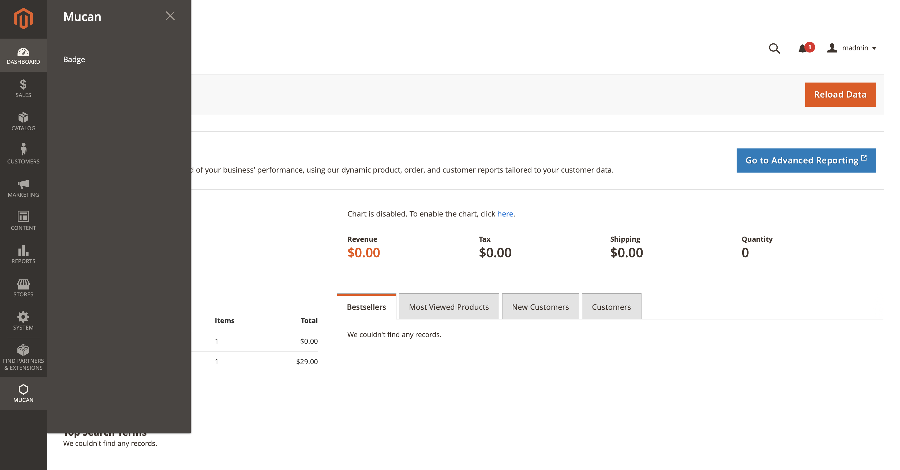
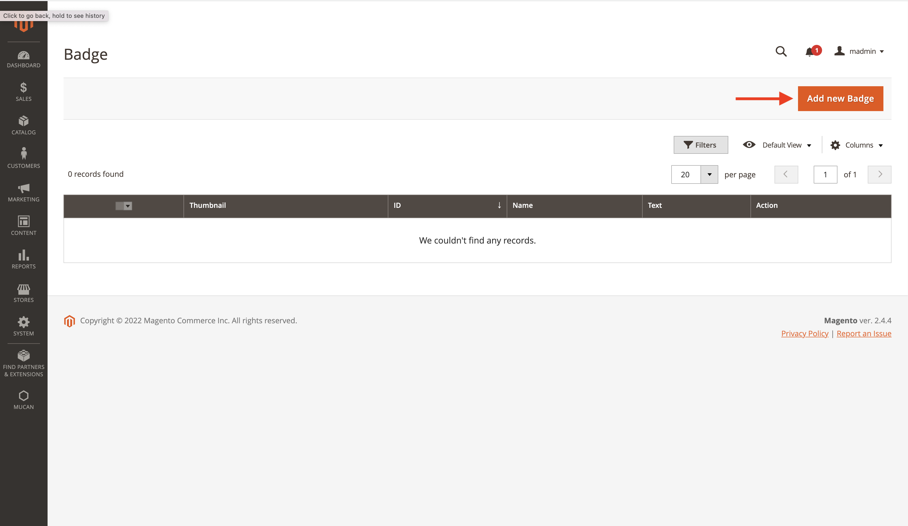
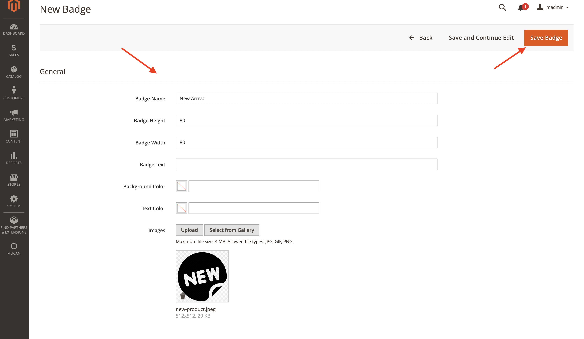
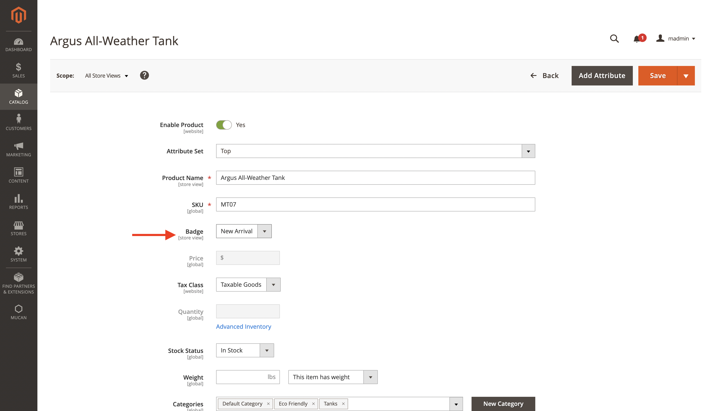
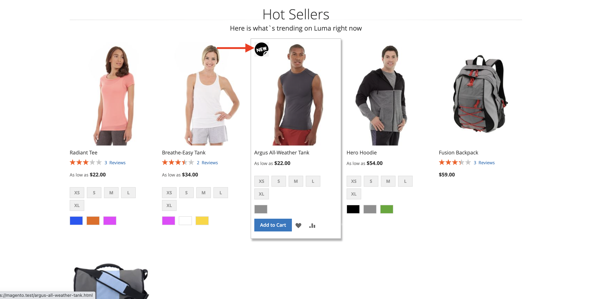

# Mage2 Module Mucan Badges

    ``mucan54/module-badges``

 - [Main Functionalities](#markdown-header-main-functionalities)
 - [Installation](#markdown-header-installation)
 - [Configuration](#markdown-header-configuration)
 - [Specifications](#markdown-header-specifications)
 - [Attributes](#markdown-header-attributes)

## Main Functionalities
Add badges to products easily

## Installation
\* = in production please use the `--keep-generated` option

### Type 1: Zip file

 - Unzip the zip file in `app/code/Mucan/Badges`
 - Enable the module by running `php bin/magento module:enable Mucan_Badges`
 - Apply database updates by running `php bin/magento setup:upgrade`\*
 - Apply less file compilation `php bin/magento setup:static-content:deploy`\*
 - Flush the cache by running `php bin/magento cache:flush`

### Type 2: Composer
(--Not avaible yet--)
 - Make the module available in a composer repository for example:
    - private repository `repo.magento.com`
    - public repository `packagist.org`
    - public github repository as vcs
 - Add the composer repository to the configuration by running `composer config repositories.repo.magento.com composer https://repo.magento.com/`
 - Install the module composer by running `composer require mucan54/module-badges`
 - enable the module by running `php bin/magento module:enable Mucan_Badges`
 - apply database updates by running `php bin/magento setup:upgrade`\*
 - Flush the cache by running `php bin/magento cache:flush`

## Configuration
You will see Mucan menu on left and you can reach badges on it.

On the grid you can see existing badges and you can create new one via Add new Badge button.

In the form you should fill all the nessesary fields as you wish and you can create.

And in the product detail page, all the badges will be appear under badges dropdown.

And the badge will appear on the frontend.

## Specifications

You can create badges with image or just text and adjust size and color as you wish.

## Attributes

You can assign any badges to products with badge attribute on product detail page.

